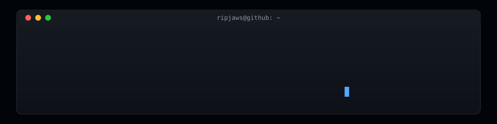

<!-- Header: animated terminal banner (assets/banner-terminal.svg) -->

  

## About me

I'm a Computer Science student at American International University-Bangladesh. I do
research in AI and machine learning, and I build full-stack web apps and AI agents.
I'm also working toward security research and penetration testing.

- **Researching:** how to use agentic AI properly in clinical decision support systems (CDSS).
- **Learning:** how to secure AI agents in production.
- **Open to:** security research and pentesting work, internships, AI engineering roles, collaboration, and freelance projects.

## Tech stack

<table>
  <tr>
    <td><b>Languages</b></td>
    <td></td>
  </tr>
  <tr>
    <td><b>Web</b></td>
    <td></td>
  </tr>
  <tr>
    <td><b>Data and AI</b></td>
    <td></td>
  </tr>
  <tr>
    <td><b>Tools</b></td>
    <td></td>
  </tr>
</table>

Also: LangGraph and LangChain for AI agents, SQL, networking fundamentals, and machine learning workflows.

## Featured projects

<table>
  <tr>
    <td width="100%">
      
      <h3><a href="https://github.com/LT-Ripjaws/SentinelOps">SentinelOps</a>: security incident management platform</h3>
      A SOC-inspired app for tracking incidents from report to resolution: assignment, an append-only audit timeline, evidence uploads, role-based access, and an analytics dashboard. Authentication uses HTTP-only cookies with refresh-token rotation and CSRF protection.
        
      
      
      
      
    </td>
  </tr>
  <tr>
    <td width="100%">
      
      <h3><a href="https://github.com/LT-Ripjaws/planner-agent-writer">BrewNarrate</a>: AI research-to-blog agent</h3>
      Turns a topic into a fully cited blog draft and streams the agent's work live. A LangGraph pipeline researches, plans, writes sections in parallel, verifies citations, and grades the result.
        
      
      
      
      
    </td>
  </tr>
  <tr>
    <td width="100%">
      
      <h3><a href="https://github.com/LT-Ripjaws/github-ai-changelog">RepoNarrate</a>: AI changelogs from GitHub history</h3>
      Connects to GitHub repositories, syncs commits and releases, turns raw commit history into readable changelog notes, and presents them with search and analytics dashboards.
        
      
      
      
      
    </td>
  </tr>
</table>

## More projects

<table>
  <tr>
    <td width="33%" valign="top">
      
      <b><a href="https://github.com/LT-Ripjaws/spam-detection-with-stacking-classifier-machine-learning">SMS Spam Detection</a></b> 
      Detects spam messages with a stacking ensemble classifier, served through a FastAPI web app. 
      <b>Python · scikit-learn · FastAPI</b>
    </td>
    <td width="33%" valign="top">
      
      <b><a href="https://github.com/LT-Ripjaws/retrorides-car-showroom-website">RetroRides</a></b> 
      A vintage car showroom site on a custom PHP MVC framework: collections, sales, bookings, and restoration services. 
      <b>PHP · MVC · MySQL</b>
    </td>
    <td width="33%" valign="top">
      
      <b><a href="https://github.com/LT-Ripjaws/react-movie-app">React Movie App</a></b> 
      A movie discovery app built on the TMDB API while practising React. 
      <b>React · TMDB API</b>
    </td>
  </tr>
</table>

## Other projects

| Project | What it is | Stack |
|---|---|---|
| [easy-langgraph](https://github.com/LT-Ripjaws/easy-langgraph) | A beginner LangGraph tutorial in 24 lessons, each with a guide and a notebook: workflows, streaming, persistence, memory, tools, multi-agent systems, RAG, and deployment. | Python, LangGraph |
| [data-structures-and-algorithms](https://github.com/LT-Ripjaws/data-structures-and-algorithms) | 46 standalone, tested C++ programs across 14 topics, from linked lists and heaps to Dijkstra and dynamic programming. | C++ |
| [Cairnveil Security Agent](https://github.com/LT-Ripjaws/carnveil-security-self-rag) | A Self-RAG workflow that answers questions from a fictional security company's internal documents: it decides when to retrieve, grades the retrieved chunks, checks that the answer is supported, and rewrites the query when needed. | Python, LangGraph, FAISS |
| [web-pentest-lab](https://github.com/LT-Ripjaws/web-pentest-lab) | A simulated web application security assessment against OWASP Juice Shop, written up as a pentest report. | Web security, OWASP |
| [Twinflare](https://github.com/LT-Ripjaws/hci-project) | A tangible-interface game for an HCI course: two handheld rockets with tilt sensors control a two-player browser game through an Arduino. | JavaScript, Arduino |
| [Chronoscape](https://github.com/LT-Ripjaws/chronoscape-computer-graphics-project) | A computer graphics scene showing a day-night transition over time. | C++, OpenGL |
| [SwiftMedAccess](https://github.com/LT-Ripjaws/swift-medaccess-cpp-project) | My first university project: a pharmacy management console app. | C++ |
| [Convertify](https://github.com/LT-Ripjaws/convertify-csharp-project) | A desktop app that converts between Word and PDF files. | C# |
| [MyRegPlanner](https://github.com/LT-Ripjaws/MyRegPlanner-csharp-project) | A planner for my university's course registration. | C# |
| [RetroRides C#](https://github.com/LT-Ripjaws/vintage-car-shop-csharp-project) | A vintage car shop desktop app from C# coursework. | C# |
| [IMDB Data Science](https://github.com/LT-Ripjaws/imdb-movie-data-science-project) | Preprocessing, exploratory analysis, and machine learning on the IMDB dataset. | R |
| [RESQ](https://github.com/LT-Ripjaws/resq-software-engineering) | Full software development lifecycle documentation from a software engineering course. | SDLC |

## Contributions

<picture>
  <source media="(prefers-color-scheme: dark)" srcset="https://raw.githubusercontent.com/LT-Ripjaws/LT-Ripjaws/output/github-snake-dark.svg" />
  <source media="(prefers-color-scheme: light)" srcset="https://raw.githubusercontent.com/LT-Ripjaws/LT-Ripjaws/output/github-snake.svg" />
  
</picture>

  

## Connect

  
  
  
  
  

Thanks for visiting. If a project is useful to you, a star helps others find it.

